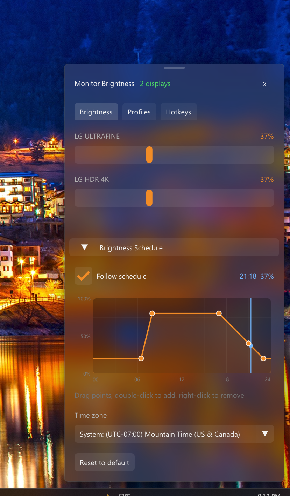
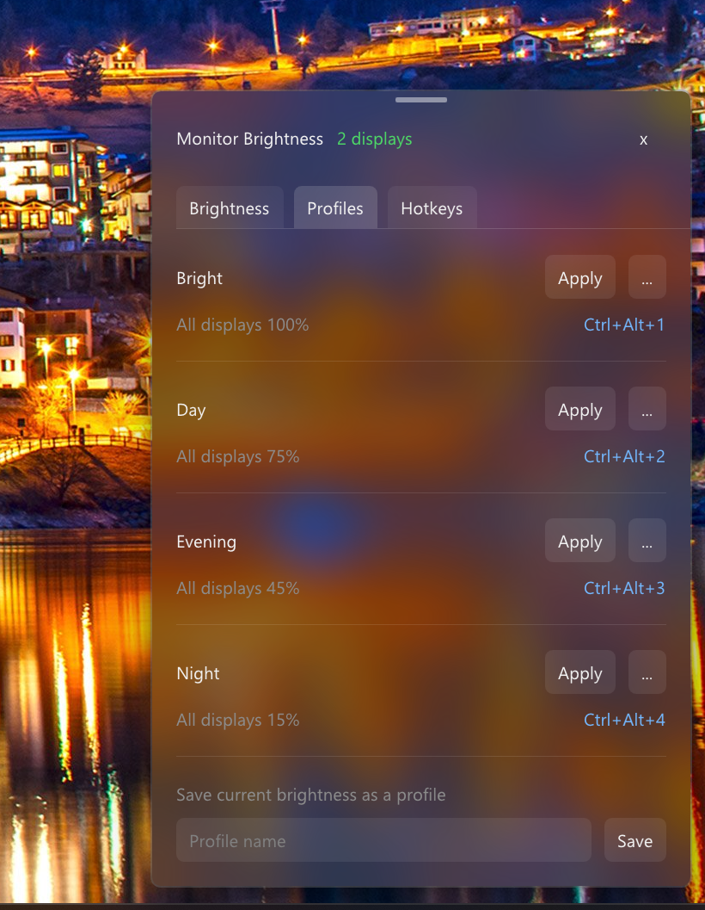

# Monitor Brightness

A frosted-glass tray widget for controlling the brightness of your external monitors on Windows.

Forked from [mengzhisy/lg-ultrafine-brightness](https://github.com/mengzhisy/lg-ultrafine-brightness), which only supported the LG UltraFine 4K/5K over USB. This fork works with any monitor that supports **DDC/CI** (most do) and keeps the original LG UltraFine support.

<p align="center">
  
  &nbsp;
  
</p>

## Features

- **Every monitor, its own slider**, detected automatically by name
- **Brightness schedule**: drag points on a 24-hour graph, in any time zone
- **Profiles**: save per-monitor brightness setups and switch with one click, a hotkey or the tray menu
- **Custom hotkeys** for brightness up/down, profiles, the schedule and showing the widget
- **Frosted glass widget** that pops up above the tray on Windows 11, resizable with scrolling
- **Handles hot-plug and sleep**, and picks up changes made with monitor buttons or other apps
- **Start with Windows**, straight to the tray

## Usage

Click the tray icon to open the widget, then click anywhere else to close it. Right-click the tray icon for presets, profiles and settings. Drag the bar at the top of the widget to resize it, and double-click the bar to reset.

Default hotkeys: `Ctrl+Alt+Up/Down` for brightness and `Ctrl+Alt+1–4` for profiles, all changeable on the **Hotkeys** tab.

## Requirements

- Windows 10/11 (64-bit); the frosted glass needs Windows 11 22H2+
- A monitor with DDC/CI enabled in its on-screen menu, or an LG UltraFine 4K/5K
- Not supported: laptop built-in screens, and most DisplayLink adapters, docks and KVMs

## Building

Needs Visual Studio 2022 Build Tools (C++ workload, which includes CMake and Ninja).

```bash
git clone --recursive https://github.com/<your-username>/lg-ultrafine-brightness.git
cd lg-ultrafine-brightness
cmake -S . -B build -G Ninja -DCMAKE_BUILD_TYPE=Release   # from a VS Developer Command Prompt
cmake --build build
```

The app is `build/LGUltrafineBrightness.exe`.
